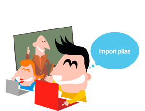
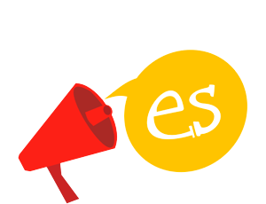
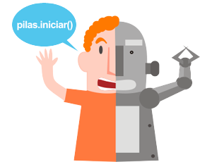
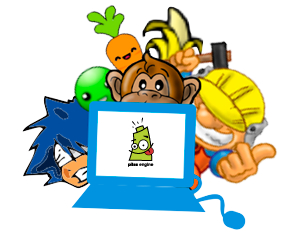

  
¡Crea tus propios videojuegos!

  
Pilas Engine te permite crear tus propios videojuegos de manera didáctica y divertida

  

    <a class="btn btn-blue white source-sans-pro" target="blank" href="http://app.pilas-engine.com.ar"> Abrir la versión online</a>
    <a class="btn btn-green white source-sans-pro" href="descargas/"> Descargar</a>
  

## ¿Que es Pilas Engine?

Pilas Engine es una herramienta para construir videojuegos de manera sencilla y divertida.

Ideamos esta herramienta para que los jóvenes puedan descubrir y aprender a programar computadoras. Creemos que aprender a programar es espectacular, porque les permite tener el control de las computadora, inventar y desarrollar cualquier tipo de software.

## ¿Qué características incluye Pilas Engine?

  

    

    
Está dirigido a personas que comienzan a programar videojuegos y quieren lograr resultados sorprendentes y divertidos en poco tiempo.

  

  

    
    
Es multiplataforma: funciona en Windows, Gnu/Linux y Mac OS X. Cualquier persona puede utilizar el motor :).

  

  

    
    
Completamente en castellano: la documentación, los tutoriales y el código programado están en tu idioma.

  

  

    
    
Es interactiva: puedes programar mientras observas resultados.

  

  

    
    
Incluye actores y ejemplos prediseñados: para que puedas comenzar a crear muchas variedades de juegos rápidamente.

  

  

    
    
Libre y gratuita: Es software libre bajo la LGPL, así que puedes copiar, modificar y distribuir el motor libremente.

  

## Nuestro equipo

En el desarrollo de pilas participamos varias personas, somos una comunidad abierta y colaborativa de
programadores, docentes y estudiates de distintas partes del mundo.

Describí y participá del proyecto desde nuestro [foro](http://foro.pilas-engine.com.ar/) o desde [github](https://github.com/pilas-engine/pilas-engine/).

  

    
    
Hugo Ruscitti

    
Lider del proyecto

    
  

  

    
    
Wally

    
Ilustrador

    
  

  

    
    
Enrique Porta

    
Desarrollador

    
  

  

    
    
Fernando Salamero

    
Desarrollador

    
  

  

    
    
Irving Rodriguez

    
Desarrollador

    
  

